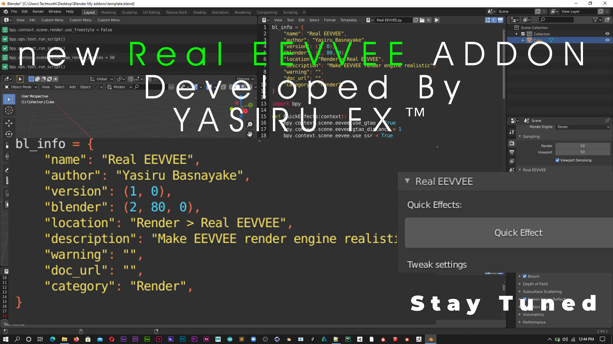

# Real_EEVVEE_Working

  

<h1>Real EEVVEE Blender Add-On</h1>

  
<strong>Author:</strong> Yasiru Basnayake

  
<strong>Version:</strong> 1.0

  
<strong>Blender Version:</strong> 2.80.0 and above

  
<strong>Category:</strong> Render

  <h2>Description:</h2>

  
Welcome to Real EEVVEE, an innovative Blender add-on developed by Yasiru Basnayake. This add-on enhances the EEVEE render engine to make it more realistic, introducing a range of features and optimizations for a better rendering experience (Beta version).

  <h2>Features:</h2>

  <ul>
      <li>Quick Effects: Easily optimize your EEVEE render settings with one click.</li>
      <li>Disable Effects: Toggle resource-intensive effects for smoother viewport performance.</li>
      <li>Quick Depth Of Field (DOP) Setup: Streamline depth of field configuration for your camera.</li>
      <li>Tweak Settings: Fine-tune various EEVEE rendering parameters for your specific needs.</li>
      <li>About: Learn more about the author, Yasiru Basnayake, and show your support.</li>
  </ul>

  <h2>Documentation:</h2>

  
For detailed instructions and demonstrations, visit the <a href="https://www.youtube.com/@yasirufx8666/videos" target="_blank">Real EEVVEE YouTube Channel</a>.

  <h2>Installation:</h2>

  <ol>
      <li>Download the add-on ZIP file.</li>
      <li>In Blender, navigate to Edit &gt; Preferences &gt; Add-ons.</li>
      <li>Click "Install" and select the downloaded ZIP file.</li>
      <li>Enable the "Real EEVVEE" add-on.</li>
  </ol>

  <h2>Usage:</h2>

  <ol>
      <li>Access the add-on from the "Render" tab in the Properties panel.</li>
      <li>Explore Quick Effects, Disable Effects, Quick DOP, Tweak Settings, and About sections.</li>
      <li>Optimize your EEVEE renders effortlessly!</li>
  </ol>

  
Feel free to contribute, report issues, or provide feedback. Let's make EEVEE rendering more realistic together!

